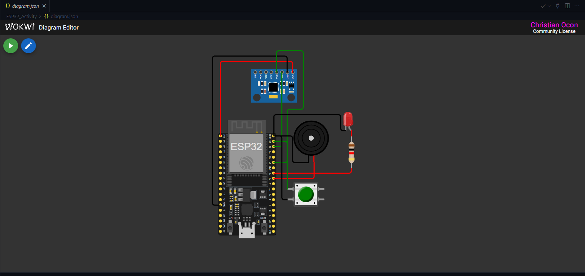

# Student Details

- **Group Number**: 10
- **Name of Members**:
  - Añana, Vince Kevin A. vinceanana45@gmail.com
  - Ocon, Christian Edison M. ocon.christiane@gmail.com
  - Villanueva, Keith Chadberc Niven Y. keithvillanueva213@gmail.com
- **Batch ID**: _BEC016_
- **University Name**: _Cebu Institute of Technology - University_

# Project Overview

## Project Title

- _Earthquake Alarm and Monitoring System_

## Problem Statement

- _Following the recent tragedy of the earthquake that devastated parts of Cebu Province, many victims were caught unaware while sleeping and were unable to react in time, highlighting the urgent need for systems that can immediately detect dangerous ground motion and alert occupants. The \_Earthquake Alarm and Monitoring System_ addresses this real-world challenge by using an MPU6050 accelerometer and an ESP32 to continuously sense abnormal vibrations and trigger an audible and visual alarm to wake individuals during seismic events, especially at night when they are most vulnerable. This system is designed for use in homes, dormitories, and residential buildings where occupants may not feel early tremors or may require immediate prompting to evacuate safely. Remote monitoring and control via AWS IoT Core are critical because they allow families, building administrators, or emergency responders to receive real-time alerts, check the status of multiple units, and remotely silence or reset alarms when needed, ensuring rapid response and improved safety even when individuals are not physically present.\_

## Objectives

1.  To develop an IoT-based Earthquake Alarm and Monitoring System that detects seismic activity, alerts occupants immediately, and provides real-time monitoring through AWS IoT Core.
2.  To measure ground vibration using the MPU6050 sensor and identify abnormal acceleration patterns indicative of an earthquake.
3.  To activate an audible and visual alarm automatically when seismic thresholds are exceeded.
4.  To transmit real-time sensor data and earthquake alerts to AWS IoT Core using the MQTT protocol.
5.  To receive remote commands from AWS IoT Core for controlling alarms, resetting the system, or adjusting detection parameters.
6.  To maintain continuous device operation with timestamped monitoring for reliable event tracking and analysis.

# Key Features

1.  **Earthquake Detection:** Uses the MPU6050 sensor to detect strong vibrations.
2.  **Alarm Activation:** Sounds a buzzer and lights an LED when shaking is detected.
3.  **Real-Time Data Upload:** Sends vibration readings and alerts to AWS IoT Core.
4.  **Remote Alarm Control:** Allows the alarm to be turned ON, OFF, or reset from the cloud
5.  **Adjustable Sensitivity:** Lets the user change how sensitive the system is to shaking
6.  **Status Updates:** Periodically reports the device’s current sensor readings and alarm state
7.  **Basic Event Logging:** Records or sends the time when an earthquake alert is triggered.

## Diagram 1: System Diagram

- Diagram Screenshot (Wokwi):



- diagram.json (Wokwi):

```json
{
	"version": 1,
	"author": "Christian Ocon",
	"editor": "wokwi",
	"parts": [
		{
			"type": "board-esp32-devkit-c-v4",
			"id": "esp",
			"top": 0,
			"left": 0,
			"attrs": {}
		},
		{
			"type": "wokwi-led",
			"id": "led1",
			"top": -22.8,
			"left": 215,
			"attrs": { "color": "red" }
		},
		{
			"type": "wokwi-pushbutton",
			"id": "btn1",
			"top": 111.8,
			"left": 124.8,
			"attrs": { "color": "green", "xray": "1" }
		},
		{
			"type": "wokwi-mpu6050",
			"id": "imu1",
			"top": -92.18,
			"left": 59.92,
			"attrs": {}
		},
		{
			"type": "wokwi-buzzer",
			"id": "bz1",
			"top": -7.2,
			"left": 136.2,
			"attrs": { "volume": "0.1" }
		},
		{
			"type": "wokwi-resistor",
			"id": "r1",
			"top": 52.8,
			"left": 210.65,
			"rotate": 90,
			"attrs": { "value": "1000" }
		}
	],
	"connections": [
		["esp:TX", "$serialMonitor:RX", "", []],
		["esp:RX", "$serialMonitor:TX", "", []],
		["imu1:VCC", "esp:3V3", "red", ["v0", "h0.08", "v-19.2", "h-115.2"]],
		["imu1:GND", "esp:GND.1", "black", ["v-28.8", "h-134.32", "v268.8"]],
		["imu1:SCL", "esp:22", "green", ["v0"]],
		[
			"imu1:SDA",
			"esp:21",
			"green",
			["v-38.4", "h48.08", "v105.6", "h-28.8", "v96"]
		],
		["esp:18", "bz1:2", "red", ["h72.04"]],
		["esp:GND.2", "bz1:1", "black", ["v0", "h33.64", "v48"]],
		["led1:A", "r1:1", "red", ["v0"]],
		["esp:19", "r1:2", "red", ["h148.84"]],
		["esp:GND.2", "led1:C", "black", ["v-38.4", "h120.04", "v28.8"]],
		["esp:23", "btn1:1.l", "green", ["h24.04"]],
		["esp:GND.2", "btn1:2.l", "black", ["v0", "h14.44", "v115.2"]]
	],
	"dependencies": {}
}
```

**Components used**:
| **Component** | **Description** | **Function in Project** |
|-----------------------|--------------------------------------------------------|-----------------------------------------------------------------------------------------|
| `ESP32 DevKit-C V4` | A powerful Wi-Fi & Bluetooth enabled microcontroller. | Reads sensor data, controls the actuator, and communicates with AWS IoT. |
| `MPU6050 Sensor` | 3-axis accelerometer and gyroscope used to detect vibrations and shaking. | Provides real-time environmental data to the ESP32. |
| `Red LED` | Light-emitting diode for visual indication. | Provides a visual alert when shaking is detected. |
| `220 Ω Resistor` | Limits current to the LED to prevent damage. | Protects the LED from overcurrent from the ESP32's GPIO pin. |
| `Buzzer` | Actuator that produces a sound. | Produces the audible earthquake alarm. |
| `Pushbutton` | Actuator that sends a digital signal when pressed. | For manual reset or alarm test mode. |
| `Jumper Wires` | Male-to-male electrical connectors. | Connects all electronic components in the circuit. |

## Diagram 2: Final Output


## AWS IoT Core Resources Details:

1. **AWS Iot Core Endpoint**: _qwertyui123456-ats.iot.us-east-1.amazonaws.com_
2. **AWS IoT Thing**:
   - **Name**: _BEC016-Thing-Group10_
   - **Link**: _https://us-west-2.console.aws.amazon.com/iot/home?region=us-west-2#/thing/BEC016-Thing-Group10_
3. **AWS IoT Certificate**:
   - **ID**: _305d3d4ab539c5b5c45hil88608e08d46b622b7ba1118dad91c2cd2f22997489_
   - **Link**: _https://us-west-2.console.aws.amazon.com/iot/home?region=us-west-2#/certificate/41032ef053a605dec6974fc0b82c60211e36b89890beaba363f8496fa87200e3_
4. **AWS IoT Policy**:
   - **Name**: _BEC016-Capstone-Policy-Group10_
   - **Link**: _https://us-west-2.console.aws.amazon.com/iot/home?region=us-west-2#/policy/BEC016-Capstone-Policy-Group10_
5. **AWS IoT Rule #1**:
   - **Name**: BEC016_Capstone_Rule01_Group10
   - **Link**: https://us-west-2.console.aws.amazon.com/iot/home?region=us-west-2#/rule/BEC016_Capstone_Rule01_Group10
   - **Description**: _Sends a command to turn on the LED and the buzzer when sensor readings exceed the set threshold/logic._
6. **AWS IoT Rule #2**:
   - **Name**: BEC016_Capstone_Rule02_Group10
   - **Link**: https://us-west-2.console.aws.amazon.com/iot/home?region=us-west-2#/rule/BEC016_Capstone_Rule02_Group10
   - **Description**: _Sends a command to turn off the LED and the buzzer when sensor readings have stopped exceed the set threshold/logic._

## ESP32 Details:

1. **Subscription Topic**: _devices/BEC016-Thing-Group10/commands_
2. **Publishing Topic**: _devices/BEC016-Thing-Group10/data_
3. **Sample JSON format for Subscription Topic**:
   ```json
   {
   	"accelX": 0,
   	"accelY": 0,
   	"accelZ": 9.80665,
   	"gyroX": 0,
   	"gyroY": 0,
   	"gyroZ": 0,
   	"temperature": 24.00059
   }
   ```
4. **Sample JSON format for Publishing Topic**:
   ```json
   {
   	"message": "Earthquake detected!",
   	"earthquake": "on"
   }
   ```

## Communication Flow

- _**Earthquake Sensor (MPU6050 on ESP32) -> ESP32 reads vibration/acceleration data -> ESP32 formats data into JSON -> Publishes via MQTT -> AWS IoT Core (MQTT broker + rules engine) -> Actuator Response**_

## References & Additional Notes

- _[Wokwi Supported Hardware Documentation](https://docs.wokwi.com/getting-started/supported-hardware)_

<!-- _Include any helpful resources or documentation used (e.g., AWS IoT guides, MQTT libraries)._
_Optional: Mention next steps for future improvements or scaling._ -->
